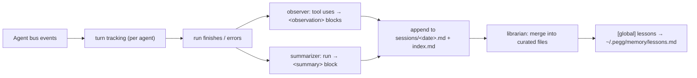

# Memory

Memory is a **persistent, markdown-based memory system** for coding agents. A background
observer watches every agent run, distills the durable parts into small structured
observations, and stores them as plain markdown files in the project — human-readable,
editable, and version-controllable. Future runs receive a compact memory panel of what
was done, decided, and learned, so the agent does not re-investigate problems that were
already solved.

Three roles make up the system:

| Role | What it does |
|---|---|
| **Observer** | Listens to agent events on the bus, collects each run's tool uses, and compresses them into `<observation>` entries via an LLM |
| **Librarian** | A second LLM pass that merges new observations into a small, high-signal "memory bank" of curated markdown files |
| **Panel** | A budget-bounded `# Project memory` block injected into the context of future runs |

Memory is **enabled by default** and works for every agent — the orchestrator,
subagents, and helper agents alike. All files live in `<project>/.pegg/memory/`, so
they are scoped per project and can be committed or cleaned up like any other file.

## How it works

The observer subscribes to the agent event bus and tracks a **turn** per agent: the
user prompt, every tool call/result pair, and the final assistant message.



The heavy work (LLM calls, file writes) happens on a dedicated background worker with a
bounded queue, so the agent is never blocked by memory processing. When the queue is
full, events are dropped with a log line rather than stalling the run.

### Turn capture

| Event | Captured data |
|---|---|
| `agent.started` | Agent id/name, parent (subagent) id, session, start time |
| `agent.input` | User prompt (clamped to 2000 chars) |
| `agent.tool.call` | Tool arguments (clamped to 2000 chars) |
| `agent.tool.result` | Tool output (clamped to 4000 chars) and error text |
| `agent.message` | Last assistant message (clamped to 3000 chars) |
| `agent.finished` / `agent.error` | Flushes the turn through the pipeline |

The observer skips its own tools (`mem-search`, `mem-read`), `askuserquestion`, and
`loadskill`, plus any tool listed in `skip_tools`.

### Dedup and ids

Every observation and summary gets a stable id from a content hash:

```text
obs-9f3a1b   sha256(sessionID | title | narrative), first 6 hex chars
sum-2c4d5e   sha256(sessionID | "summary" | learned | completed), first 6 hex chars
```

The id is written into the index and the block heading. When the same content occurs
again, the index already knows the id and the duplicate is dropped.

## Storage layout

All memory is plain markdown, organized under the project's `.pegg/` directory:

```text
<project>/.pegg/memory/
├── index.md                  # searchable index of every entry
├── active_context.md         # curated: current task state (max ~12 lines)
├── decisions.md              # curated: technical decisions and why (max 3 KB)
├── lessons.md                # curated: gotchas, patterns, trade-offs (max 3 KB)
├── notes.md                  # curated: architecture facts, APIs, conventions (max 3 KB)
└── sessions/
    └── 2026-10-03.md         # raw observations + summaries, one file per day

~/.pegg/memory/lessons.md   # global lessons, applied in every project
```

### `index.md`

A pipe-separated table. Rows are appended as entries are stored and read back by the
search tool and the memory panel:

```text
obs-9f3a1b | 2026-10-03T14:28 | bugfix | Fixed auth token refresh | auth, tokens | 2026-10-03.md
sum-2c4d5e | 2026-10-03T14:30 | summary | Session summary | | 2026-10-03.md
```

Columns: `ID | Date | Type | Title | Keywords | File`. Titles and keywords are
sanitized (`|` and newlines replaced) so the format stays stable.

### Session files

Each stored observation is a `## ` heading followed by metadata lines and a narrative.
This is exactly what `mem-read` returns:

```markdown
## obs-9f3a1b [bugfix] Fixed auth token refresh — 2026-10-03T14:28:37Z
- subtitle: 401 on expired refresh tokens
- files: internal/auth/token.go
- keywords: auth, tokens
- facts:
  - refresh endpoint returned 401 on expired refresh tokens
  - added retry-once with a fresh token request
- session: a1b2c3d4
- agent: developer
- hash: 9f3a1b...

The refresh endpoint rejected expired refresh tokens with a 401. The fix requests a new
token once and retries the original call before surfacing the error.
```

Session summaries use the same shape with `[summary]` as the type and the summary
fields (`request`, `investigated`, `learned`, `completed`, `next_steps`, `notes`) as
metadata lines.

### Curated files (the memory bank)

After observations are stored, the **librarian** merges the new blocks into the four
curated files, rewriting each completely. Its rules:

- Preserve every existing durable entry — merge, never drop unless clearly duplicated
- Drop noise: placeholder edits, trivial read-only facts, already-known information
- `active_context.md` holds the current task state: what is in progress, what was
  completed, and concrete next steps
- `decisions.md` holds durable technical decisions and why they were made
- `lessons.md` holds gotchas, patterns, and trade-offs
- `notes.md` holds architecture facts, APIs, conventions, and glossary terms
- Keep bullets terse; preserve file paths, identifiers, and commands exactly

Consolidation can be disabled with `consolidate: false`; the raw session files and the
index continue to work either way.

### Global lessons

A lesson that applies in **any** project is marked with a `[global]` prefix:

```markdown
- [global] prefer the VFS sandbox over direct os operations in tools
```

The librarian produces this marker; the memory manager detects it and appends the
lesson (clamped to 300 chars) to `~/.pegg/memory/lessons.md`. Global lessons are the
only part of the memory that crosses project boundaries.

## Observation types

The observer can emit nine observation types:

| Type | Meaning |
|---|---|
| `bugfix` | A defect was diagnosed and fixed |
| `feature` | A new capability was added |
| `refactor` | Code was restructured without changing behavior |
| `change` | Behavior or configuration was changed |
| `discovery` | Something non-obvious was learned about the codebase or environment |
| `decision` | A design or technical decision was made — and why |
| `security_alert` | A vulnerability or security problem was found |
| `security_note` | A security-relevant fact, e.g. a permission model |
| `sensitive` | Sensitive user information or secrets were handled |

Each observation carries a title, an optional subtitle, facts, concepts, and a
2–4 sentence narrative. The observer is instructed to skip noise: trivial reads of
known files, placeholder edits, and shell commands that produced nothing.

## The memory panel

At the start of every run (and resume), the manager injects a **memory panel** into the
agent's context as a system reminder:

```xml
<system-reminder>
# Project memory
## Active context
- refactoring the memory store; sessions/ file layout is done
- next: index compaction

## Decisions
- observations live in markdown, not sqlite (human-reviewable)

- [discovery] Memory panel budget is configurable (obs-1a2b3c) · 2026-10-03
</system-reminder>
```

The panel is built in this order, newest entries last:

1. **Active context**, **Decisions**, **Lessons**, **Notes** — the curated files, each
   clamped to 1500 chars
2. **Recent entries** — a compact `- [type] title (id) · date — keywords` line for
   each recent index entry, newest first

Everything must fit the `context_budget` (default **8000 chars**); sections that do not
fit are dropped whole. The panel is skipped entirely while the observer is mid-flush
(to avoid recursive LLM traffic) and when the project has no memory yet.

## Search tools

The agent can query memory on demand with two tools:

| Tool | Description |
|---|---|
| `mem-search` | Keyword search over all stored entries, returns scored results as XML. Use it *before* re-investigating something that may already be solved |
| `mem-read` | Fetch the full markdown block of an entry by id (e.g. `obs-9f3a1b`) |

`mem-search` takes `query` (required) and `limit` (1–10, default from `max_results`).
Sessions files are split into blocks and scored:

| Match | Score |
|---|---|
| Exact query in the title | `100 + number of terms` |
| Query term in the title | `4` per term |
| Query term in the body | `1` per term |

Files larger than 1 MB are skipped. The results are returned as XML for reliable
parsing:

```xml
<memory_results query="auth token refresh" count="2">
  <result>
    <id>obs-9f3a1b</id>
    <type>bugfix</type>
    <title>Fixed auth token refresh</title>
    <date>2026-10-03T14:28</date>
    <file>2026-10-03.md</file>
    <snippet>The refresh endpoint rejected expired refresh tokens with a 401...</snippet>
  </result>
</memory_results>
```

### Relevance gating

Raw keyword hits can be noisy, so results are filtered by a **relevance gate** before
being returned:

| Gate | Behavior |
|---|---|
| `auto` (default) | Use the decision model when a decision provider is available, otherwise fall back to score-based gating |
| `decision` | Ask the decision model one boolean question per candidate ("is this relevant?") and keep hits at or above `threshold` |
| `llm` | Ask the observer LLM to return the comma-separated numbers of relevant candidates (or `none`) |
| `score` | Keep only hits whose score is at least half of the best score (free, no model calls) |
| `off` | Return every keyword hit unfiltered |

The **relevance threshold** (default `0.6`) only applies to `decision` gating (and to
`auto` when it resolves to decision). When the configured gate cannot run — no decision
provider, no LLM — gating degrades gracefully to the score-based filter.

## Configuration

Memory is configured under the `memory` key in `~/.peggco/pegg.json`:

```json
{
  "memory": {
    "enabled": true,
    "provider": "openrouter",
    "model": "deepseek/deepseek-chat",
    "gate": "auto",
    "threshold": 0.6,
    "context_budget": 8000,
    "max_results": 5,
    "consolidate": true,
    "skip_tools": ["websearch"]
  }
}
```

| Key | Type | Default | Description |
|---|---|---|---|
| `enabled` | bool | `true` | Master switch for capture, storage, and panel injection |
| `provider` | string | — | Provider for the observer/summarizer/librarian LLM calls. Empty uses the running agent's model (recommended) |
| `model` | string | — | Model for memory LLM calls (only read when `provider` is set) |
| `gate` | string | `"auto"` | Relevance gate for `mem-search`: `auto`, `decision`, `llm`, `score`, or `off` |
| `threshold` | number | `0.6` | Minimum decision-model relevance for `decision` gating |
| `context_budget` | int | `8000` | Max chars of the injected memory panel |
| `max_results` | int | `5` | Default result count for `mem-search` |
| `consolidate` | bool | `true` | Run the librarian to keep curated files up to date |
| `skip_tools` | string[] | — | Additional tools whose results are never captured |

The observer provider is resolved with preference for the configured `provider`/`model`
pair; otherwise the agent's current model is used. If `provider` names a
decision-model provider (e.g. OpenRouter's JEV), it is used for **relevance gating**;
the observation/summarization LLM calls fall back to the agent's preferred model.

## TUI settings

Open Settings with ++ctrl+p++ and switch to the **Memory** tab. Navigate with
++up++/++down++; toggle switches and adjust values with ++enter++ or ++left++/++right++:

| Row | Description |
|---|---|
| **Enabled** | Master switch (on/off) |
| **Observer** | Provider/model for memory LLM calls, or "default (agent model)". Opens a searchable picker with decision providers and LLM models |
| **Relevance gating** | Cycle `auto` → `decision` → `llm` → `score` → `off` |
| **Relevance threshold** | `0.05`–`1.0` (only active for decision gating) |
| **Context budget** | `500`–`100000` chars |
| **Max results** | `1`–`10` |
| **Consolidate** | Run the librarian after each run (on/off) |
| **Entries / Last entry** | Read-only stats from the index |
| **Clear memory** | Deletes all memory files for the project (with confirmation) |

Changes are saved to `~/.peggco/pegg.json` immediately and apply to the running
manager without a restart.

## Cost and operational notes

- Memory runs one LLM call per finished run for observations, one for the summary, and
  one for the librarian — all on the background worker with a single iteration and no
  tools. With the default `provider` unset, these calls reuse the agent's own
  model/provider.
- All captured payloads are clamped before any LLM call (2 KB prompt, 2 KB tool input,
  4 KB tool output), so runs with heavy tool traffic stay cheap.
- The store is a set of plain files with a mutex — safe for single-process use. Memory
  is project-scoped; the only cross-project data is `~/.pegg/memory/lessons.md`.
- To start fresh, use **Settings → Memory → Clear memory**, or delete
  `<project>/.pegg/memory/` manually. Global lessons can be edited by hand at any
  time — everything is plain markdown.